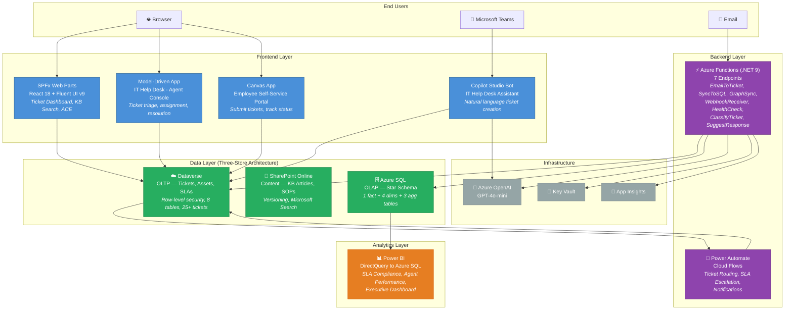
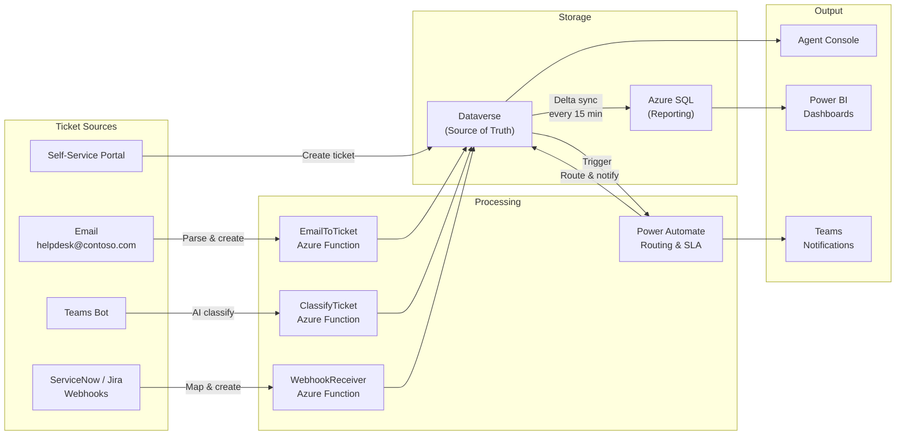
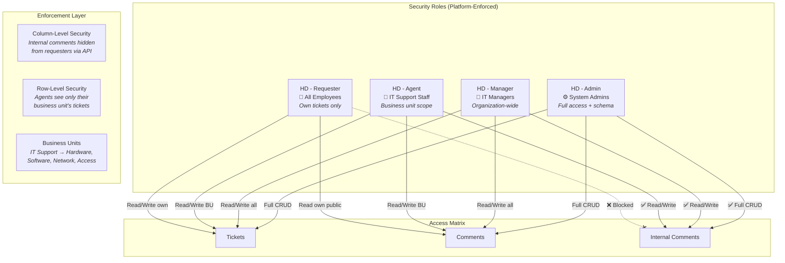
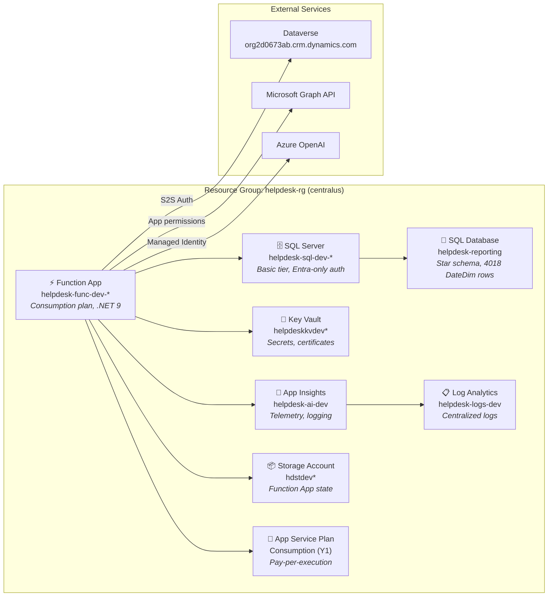
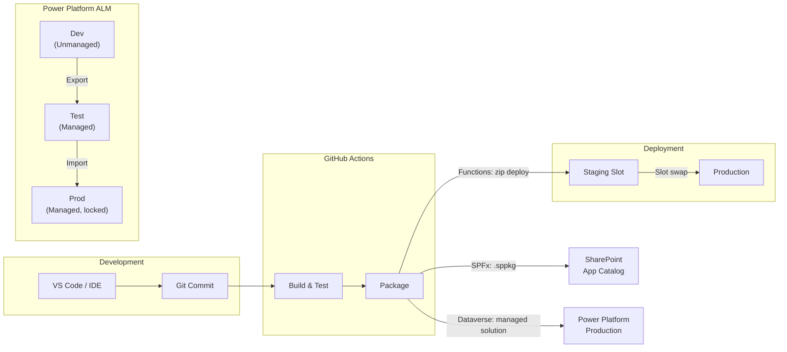

# Enterprise Help Desk — Architecture Diagrams

## System Architecture

```mermaid
graph TB
    subgraph Users["End Users"]
        Browser["🌐 Browser"]
        Teams["💬 Microsoft Teams"]
        Email["📧 Email"]
    end

    subgraph Frontend["Frontend Layer"]
        SPFx["SPFx Web Parts<br/>React 18 + Fluent UI v9<br/><i>Ticket Dashboard, KB Search, ACE</i>"]
        MDA["Model-Driven App<br/>IT Help Desk - Agent Console<br/><i>Ticket triage, assignment, resolution</i>"]
        Canvas["Canvas App<br/>Employee Self-Service Portal<br/><i>Submit tickets, track status</i>"]
        Bot["Copilot Studio Bot<br/>IT Help Desk Assistant<br/><i>Natural language ticket creation</i>"]
    end

    subgraph Data["Data Layer (Three-Store Architecture)"]
        DV["☁️ Dataverse<br/>OLTP — Tickets, Assets, SLAs<br/><i>Row-level security, 8 tables, 25+ tickets</i>"]
        SP["📄 SharePoint Online<br/>Content — KB Articles, SOPs<br/><i>Versioning, Microsoft Search</i>"]
        SQL["🗄️ Azure SQL<br/>OLAP — Star Schema<br/><i>1 fact + 4 dims + 3 agg tables</i>"]
    end

    subgraph Backend["Backend Layer"]
        Func["⚡ Azure Functions (.NET 9)<br/>7 Endpoints<br/><i>EmailToTicket, SyncToSQL, GraphSync,<br/>WebhookReceiver, HealthCheck,<br/>ClassifyTicket, SuggestResponse</i>"]
        PA["🔄 Power Automate<br/>Cloud Flows<br/><i>Ticket Routing, SLA Escalation,<br/>Notifications</i>"]
    end

    subgraph Analytics["Analytics Layer"]
        PBI["📊 Power BI<br/>DirectQuery to Azure SQL<br/><i>SLA Compliance, Agent Performance,<br/>Executive Dashboard</i>"]
    end

    subgraph Infra["Infrastructure"]
        KV["🔑 Key Vault"]
        AI["📡 App Insights"]
        AOAI["🤖 Azure OpenAI<br/>GPT-4o-mini"]
    end

    Browser --> SPFx
    Browser --> MDA
    Browser --> Canvas
    Teams --> Bot
    Email --> Func

    SPFx --> DV
    MDA --> DV
    Canvas --> DV
    Bot --> DV
    Bot --> AOAI

    PA --> DV
    Func --> DV
    Func --> SQL
    Func --> AOAI
    Func --> KV
    Func --> AI

    DV --> PA
    SQL --> PBI

    classDef frontend fill:#4a90d9,stroke:#2c5f8a,color:#fff
    classDef data fill:#27ae60,stroke:#1e8449,color:#fff
    classDef backend fill:#8e44ad,stroke:#6c3483,color:#fff
    classDef analytics fill:#e67e22,stroke:#d35400,color:#fff
    classDef infra fill:#95a5a6,stroke:#7f8c8d,color:#fff

    class SPFx,MDA,Canvas,Bot frontend
    class DV,SP,SQL data
    class Func,PA backend
    class PBI analytics
    class KV,AI,AOAI infra
```

## Data Flow

```mermaid
flowchart LR
    subgraph Sources["Ticket Sources"]
        Portal["Self-Service Portal"]
        EmailIn["Email<br/>helpdesk@contoso.com"]
        TeamsBot["Teams Bot"]
        Webhook["ServiceNow / Jira<br/>Webhooks"]
    end

    subgraph Processing["Processing"]
        PA["Power Automate<br/>Routing & SLA"]
        EmailFunc["EmailToTicket<br/>Azure Function"]
        WebhookFunc["WebhookReceiver<br/>Azure Function"]
        ClassifyFunc["ClassifyTicket<br/>Azure Function"]
    end

    subgraph Storage["Storage"]
        DV["Dataverse<br/>(Source of Truth)"]
        SQL["Azure SQL<br/>(Reporting)"]
    end

    subgraph Output["Output"]
        App["Agent Console"]
        PBI["Power BI<br/>Dashboards"]
        Notify["Teams<br/>Notifications"]
    end

    Portal -->|Create ticket| DV
    EmailIn -->|Parse & create| EmailFunc --> DV
    TeamsBot -->|AI classify| ClassifyFunc --> DV
    Webhook -->|Map & create| WebhookFunc --> DV

    DV -->|Trigger| PA
    PA -->|Route & notify| DV
    PA --> Notify

    DV -->|Delta sync<br/>every 15 min| SQL
    SQL --> PBI
    DV --> App
```

## Security Model

```mermaid
graph TB
    subgraph Roles["Security Roles (Platform-Enforced)"]
        R1["HD - Requester<br/>👤 All Employees<br/><i>Own tickets only</i>"]
        R2["HD - Agent<br/>🔧 IT Support Staff<br/><i>Business unit scope</i>"]
        R3["HD - Manager<br/>👔 IT Managers<br/><i>Organization-wide</i>"]
        R4["HD - Admin<br/>⚙️ System Admins<br/><i>Full access + schema</i>"]
    end

    subgraph Access["Access Matrix"]
        direction LR
        T1["Tickets"]
        T2["Comments"]
        T3["Internal Comments"]
    end

    R1 -->|"Read/Write own"| T1
    R1 -->|"Read own public"| T2
    R1 -.-x|"❌ Blocked"| T3

    R2 -->|"Read/Write BU"| T1
    R2 -->|"Read/Write BU"| T2
    R2 -->|"✅ Read/Write"| T3

    R3 -->|"Read/Write all"| T1
    R3 -->|"Read/Write all"| T2
    R3 -->|"✅ Read/Write"| T3

    R4 -->|"Full CRUD"| T1
    R4 -->|"Full CRUD"| T2
    R4 -->|"✅ Full CRUD"| T3

    subgraph Enforcement["Enforcement Layer"]
        CLS["Column-Level Security<br/><i>Internal comments hidden<br/>from requesters via API</i>"]
        RLS["Row-Level Security<br/><i>Agents see only their<br/>business unit's tickets</i>"]
        BU["Business Units<br/><i>IT Support → Hardware,<br/>Software, Network, Access</i>"]
    end
```

## Infrastructure (Azure)

```mermaid
graph LR
    subgraph RG["Resource Group: helpdesk-rg (centralus)"]
        Func["⚡ Function App<br/>helpdesk-func-dev-*<br/><i>Consumption plan, .NET 9</i>"]
        SQL["🗄️ SQL Server<br/>helpdesk-sql-dev-*<br/><i>Basic tier, Entra-only auth</i>"]
        DB["💾 SQL Database<br/>helpdesk-reporting<br/><i>Star schema, 4018 DateDim rows</i>"]
        KV["🔑 Key Vault<br/>helpdeskkvdev*<br/><i>Secrets, certificates</i>"]
        AI["📡 App Insights<br/>helpdesk-ai-dev<br/><i>Telemetry, logging</i>"]
        LA["📋 Log Analytics<br/>helpdesk-logs-dev<br/><i>Centralized logs</i>"]
        ST["📦 Storage Account<br/>hdstdev*<br/><i>Function App state</i>"]
        Plan["📐 App Service Plan<br/>Consumption (Y1)<br/><i>Pay-per-execution</i>"]
    end

    Func --> SQL
    Func --> KV
    Func --> AI
    SQL --> DB
    AI --> LA
    Func --> Plan
    Func --> ST

    subgraph External["External Services"]
        DV["Dataverse<br/>org2d0673ab.crm.dynamics.com"]
        Graph["Microsoft Graph API"]
        AOAI["Azure OpenAI"]
    end

    Func -->|S2S Auth| DV
    Func -->|App permissions| Graph
    Func -->|Managed Identity| AOAI
```

## Deployment Pipeline

```mermaid
graph LR
    subgraph Dev["Development"]
        Code["VS Code / IDE"]
        Git["Git Commit"]
    end

    subgraph CI["GitHub Actions"]
        Build["Build & Test"]
        Package["Package"]
    end

    subgraph Deploy["Deployment"]
        Staging["Staging Slot"]
        Prod["Production"]
    end

    Code --> Git --> Build --> Package
    Package -->|"Functions: zip deploy"| Staging -->|"Slot swap"| Prod
    Package -->|"SPFx: .sppkg"| AppCat["SharePoint<br/>App Catalog"]
    Package -->|"Dataverse: managed solution"| PProd["Power Platform<br/>Production"]

    subgraph Environments["Power Platform ALM"]
        PPDev["Dev<br/>(Unmanaged)"]
        PPTest["Test<br/>(Managed)"]
        PPProd2["Prod<br/>(Managed, locked)"]
    end

    PPDev -->|"Export"| PPTest -->|"Import"| PPProd2
```
